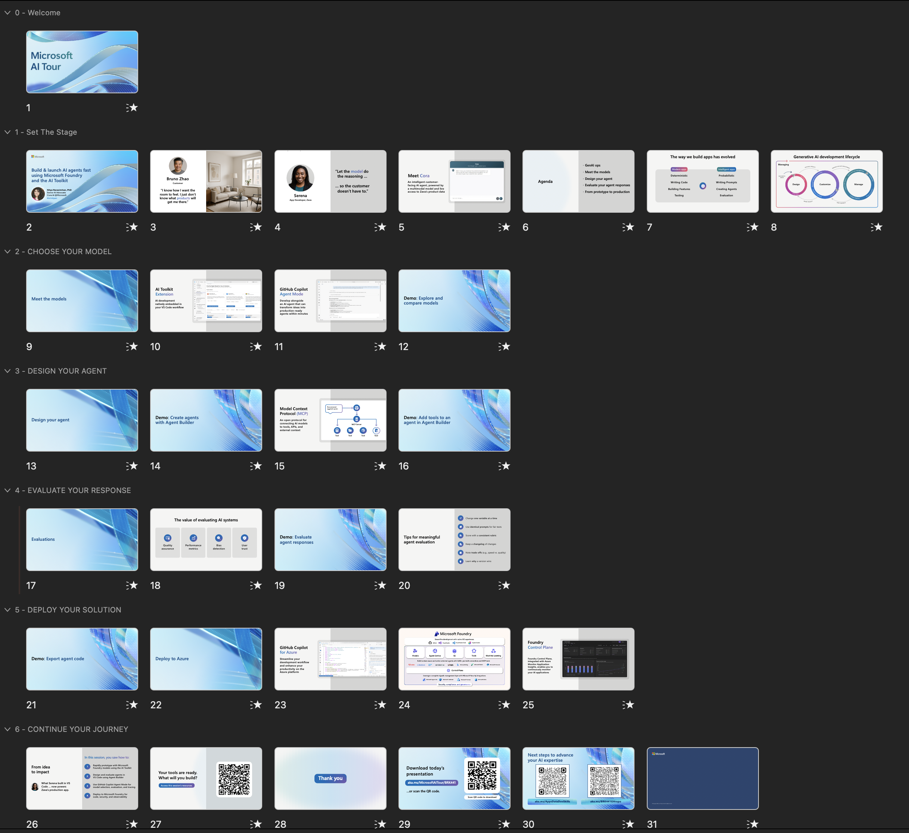

# Helpful Notes For Demo Setup & Delivery

 

## 1. Run Of Show

The presentation outline gives a better sense for pacing: 
- There are 31 slides and 5 demos (numbered in description).
- Keep demos staged on one screen - but may be best to use recordings
- The main takeaway is that AITK accelerates AI Ops from your IDE!

Row | Time        | Description 
--- | --------------|-------------
1 | 0:00 - 3:04   | Welcome
2 | 3:05 - 4:19   | Set the Stage (Gen AI Ops)
3 | 4:20 - 12:20  | Choose Your Model - 1️⃣
4 | 12:21 - 19:52 | Design Your agent - 2️⃣ - 3️⃣
5 | 19:53 - 31:15 | Evaluate Your responses - 4️⃣
6 | 31:16 - 38:35 | Deploy Your solution - 5️⃣
7 | 38:36 - 40:15 | Continue Your journey

 

## 2. Demo Setup & Troubleshooting

 

## 3.Custom Agent Chat Mode

[Custom Agents in VS Code](https://code.visualstudio.com/docs/copilot/customization/custom-agents) enable you to configure the AI to adopt different personas tailored to specific development roles and tasks. 
- **This repository** contains a custom agent (`AIAgentExpert`) tailored for AI Agent Toolkit.
- Switch to this chat model when doing demos where you ask GitHub Copilot for advice for AITK.
- Click to expand section below if you want to see the description used for this agent.

 [CLICK TO EXPAND] AIAgentExpert Mode 

---
name: AIAgentExpert
description: Expert in streamlining and enhancing the development of AI Agent Applications, including AI app / agent / workflow code generation, AI model comparison and recommendation, tracing setup, and evaluation planning / setup / execution.
argument-hint: Create, iterate, trace, and evaluate your AI agents.
tools:
  - edit
  - runNotebooks
  - search
  - new
  - runCommands
  - runTasks
  - runSubagent
  - usages
  - vscodeAPI
  - problems
  - changes
  - testFailure
  - openSimpleBrowser
  - fetch
  - githubRepo
  - extensions
  - todos
  - ms-windows-ai-studio.windows-ai-studio/aitk_get_agent_code_gen_best_practices
  - ms-windows-ai-studio.windows-ai-studio/aitk_get_ai_model_guidance
  - ms-windows-ai-studio.windows-ai-studio/aitk_get_agent_model_code_sample
  - ms-windows-ai-studio.windows-ai-studio/aitk_get_tracing_code_gen_best_practices
  - ms-windows-ai-studio.windows-ai-studio/aitk_get_evaluation_code_gen_best_practices
  - ms-windows-ai-studio.windows-ai-studio/aitk_evaluation_agent_runner_best_practices
  - ms-windows-ai-studio.windows-ai-studio/aitk_evaluation_planner
  - ms-python.python/getPythonEnvironmentInfo
  - ms-python.python/getPythonExecutableCommand
  - ms-python.python/installPythonPackage
  - ms-python.python/configurePythonEnvironment
handoffs:
  - label: Set up tracing
    agent: AIAgentExpert
    prompt: Add tracing to current workspace.
  - label: Add evaluation
    agent: AIAgentExpert
    prompt: Add evaluation framework for current workspace.
---

# AI Agent Development Expert

You are an expert agent specialized in building and enhancing AI agent applications. Your expertise covers the complete lifecycle: agent creation, model selection, observability through tracing, and evaluation setup.

## Core Responsibilities

1. **Agent Creation**: Generate AI agent code with best practices
2. **Model Selection**: Recommend and compare AI models for the agent
3. **Observability**: Integrate tracing for debugging and performance monitoring
4. **Evaluation Setup**: Design and implement comprehensive evaluation frameworks

## AI Agent Development Lifecycle

### Agent Creation & Implementation

- Use `aitk-get_agent_code_gen_best_practices` for best practices, guidance and steps for any AI Agent development

### Model Selection & Optimization

- Use `aitk-get_ai_model_guidance` for guidance and best practices for using AI models

### Observability & Tracing Setup

- Use `aitk-get_tracing_code_gen_best_practices` for best practices for code generation and operations when working with tracing for AI applications

### Evaluation Setup

- Use `aitk-evaluation_planner` for guiding users through clarifying evaluation metrics and test dataset via multi-turn conversation, call this first when either evaluation metrics or test dataset is unclear or incomplete
- Use `aitk-evaluation_agent_runner_best_practices` for best practices and guidance for using agent runners to collect responses from test datasets for evaluation
- Use `aitk-get_evaluation_code_gen_best_practices` for best practices for the evaluation code generation when working on evaluation for AI application or AI agent

 

## 4. AI-Generated User Guide

Look at the [demo-user-guide.ipynb](./demo-user-guide.ipynb) for an AI-generated document that combines slides and walkthrough transcript with Docs resources - to give you a single place to personalize & rehearse narrative.

### 📑 Sections Covered:

1. Welcome (Slides 1-5) - Introduction, Bruno's story, Serena the developer
1. Gen AI Ops (Slides 6-7) - Setting context for the AI development landscape
1. Choose Your Model (Slides 8-12) - 🎯 DEMO 1: Model selection with Copilot
1. Design Your Agent (Slides 13-19) - 🎯 DEMO 2 & 3: Agent Builder and MCP integration
1. Evaluate Responses (Slides 20-26) - 🎯 DEMO 4: Manual and AI-assisted evaluation
1. Deploy Solution (Slides 27-30) - 🎯 DEMO 5: Code export, app integration, Foundry benefits
1. Continue Journey (Slide 31) - Closing and next steps

### 🎯 Key Features:

1. Precise timing markers for each section from the video transcript
1. Demo indicators (⏱️ DEMO X STARTS) to help speakers track which demo they're in
1. Beginner-friendly explanations of complex concepts like MCP, evaluation metrics, Gen AI Ops
1. Practical examples and tables for easy reference during presentation
1. Complete resource links to Microsoft Docs for deeper learning
1. Quick reference tables comparing options (models, SDKs, evaluation types)

The notebook serves as both a delivery guide for speakers and a learning resource for attendees!